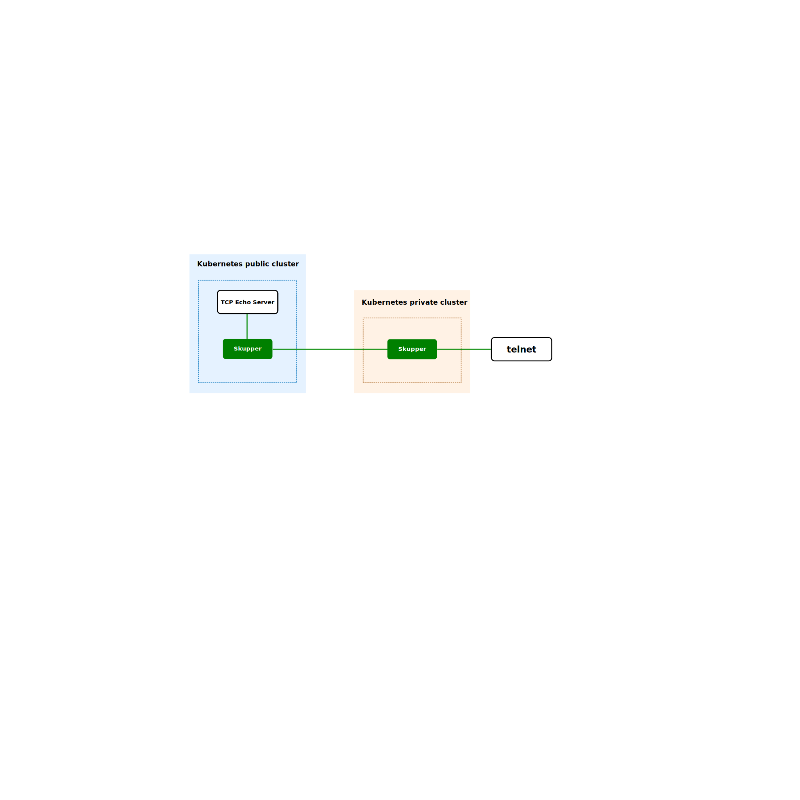

# Skupper enables inter-cluster TCP communication

TCP tunneling with [Skupper](https://skupper.io/)

* [Overview](#overview)
* [Prerequisites](#prerequisites)
* [Step 1: Set up the demo](#step-1-set-up-the-demo)
* [Step 2: Deploy the Virtual Application Network](#step-2-set-up-the-virtual-application-network)
* [Step 3: Access the public service remotely](#step-3-access-the-public-service-remotely)
* [What just happened?](#what-just-happened)
* [Cleaning up](#cleaning-up)
* [Next steps](#next-steps)

## Overview

This is a simple demonstration of TCP communication tunneled through a Skupper network from a private to a public cluster and back again. During development of this demonstration, the private cluster was running locally, while the public cluster was on AWS.
 
We will set up a Skupper network between the two clusters, start a TCP echo-server on the public cluster, then communicate to it from the private cluster and receive its replies. At no time is any port opened on the machine running the private cluster.
 

## Prerequisites

* The `kubectl` command-line tool, version 1.15 or later ([installation guide](https://kubernetes.io/docs/tasks/tools/install-kubectl/))
* The `skupper` command-line tool, the latest version ([installation guide](https://skupper.io/start/index.html#step-1-install-the-skupper-command-line-tool-in-your-environment))
* Two Kubernetes clusters, from any providers you choose. ( In this example, the clusters are called 'public' and 'private'. )

## Step 1: Set Up the Demo

1. On your local machine, clone the example repo:
>     
>     cd  # Go to your ${HOME} directory.
>     git clone https://github.com/skupperproject/skupper-example-tcp-echo
2. Still on your local machine, open two separate terminal sessions: one for the 'public' and one for the 'private' cluster.

## Step 2: Set Up the Virtual Application Network

1. Set Up the Public Cluster
    1. Go to your public session terminal window.
    2. Make your public kubeconfig file.
>     
>     export KUBECONFIG=/tmp/public-kubeconfig
    3. Log in to this public cluster.
    4. Create 'public' namespace and go into it.
>     
> kubectl create namespace public   
> kubectl config set-context \--current \--namespace public
    5. Deploy the tcp-echo service.
>     
>     kubectl apply -f ${HOME}/skupper-example-tcp-echo/public-deployment.yaml  
    6. Start Skupper, and expose the service.
>     
>     skupper init  
>     skupper expose --port 9090 deployment tcp-go-echo
    7. Make the token that lets other sites connect to this one.
>     
>     skupper token create /tmp/public-secret.yaml

2. Set Up the Private Cluster
    1. Go to your 'private' session terminal window.
    2. Make a kubeconfig file for this cluster.
>     
>     export KUBECONFIG=/tmp/private-kubeconfig
    3. Log in to the private cluster
    4. Create 'private' namespace and go into it.
>     
>     kubectl create namespace private
>     kubectl config set-context --current --namespace private
    5. Start Skupper and link to the public cluster.
>     skupper init
>     skupper link create /tmp/public-secret.yaml
    6. Check the link status.
>     skupper link status
    7. You should see a message like this:
>     Link link1 is active
    8. If the link status is not yet active, wait a few seconds and try again.

## Step 3: Access the public service remotely

1. Go to your private cluster terminal window.
2. Find the tcp-go-echo service.
>     
>     kubectl get svc
3. Among the responses, see something like this: 
>     
>     tcp-go-echo 172.21.33.62 9090/TCP
4. Forward your local machine's port 9090 to the tcp-go-echo service: 
>     
>     kubectl port-forward service/tcp-go-echo 9090:9090
5. Start a third terminal session, and go into it.
6. Start a telnet session to the forwarded port:
>     
>     telnet 0.0.0.0 9090
7. Type some text, hit enter, and see it returned to you in all caps.
>     
>     hello, Skupper
>     tcp-go-echo-7ddbc7756c-wxgcq : HELLO, SKUPPER

## What just happened?

Both of these clusters are, in fact, public, but this would work the same way if one of them were actually private.
 
 
The TCP echo server was deployed and running on our 'public' cluster. The use of Skupper on that cluster allowed us to generate a connection token, which we then used to securely connect to that cluster from the private one. Please note that, since the connection was initiated by the Skupper instance on the *private* cluster, no ports on the private cluster were ever opened!
 
 
Because we told Skupper to expose the TCP Echo service, the two Skupper instances communicated with each other and the private instance learned about the TCP Echo service. The Skupper instance on the private cluster then made a forwarder to that service available on its cluster. 
 
 
We then forwarded port 9090 on our local machine to the same port on the private cluster. When we started a telnet session to that port, the two instances of Skupper handled all communication, allowing us to transparently access a service running on a public cluster from the security of our private cluster.
 
 
And all Skupper traffic between the two clusters was secured with mutual TLS.

## Cleaning Up

Delete the pod and the virtual application network that were created in the demonstration.

1. In the terminal for the public cluster, get the pod id, delete it, and delete Skupper :
>     
>     kubectl get pods
>     kubectl delete pod tcp-go-echo-<TCP-GO-ECHO-POD-ID>
>     skupper delete

2. In the terminal for the private cluster, delete Skupper :
>     
>     skupper delete

## Next steps

 - [Try the example for Sharing a PostgreSQL database across clusters](https://github.com/skupperproject/skupper-example-postgresql)
 - [Find more examples](https://skupper.io/examples/)

